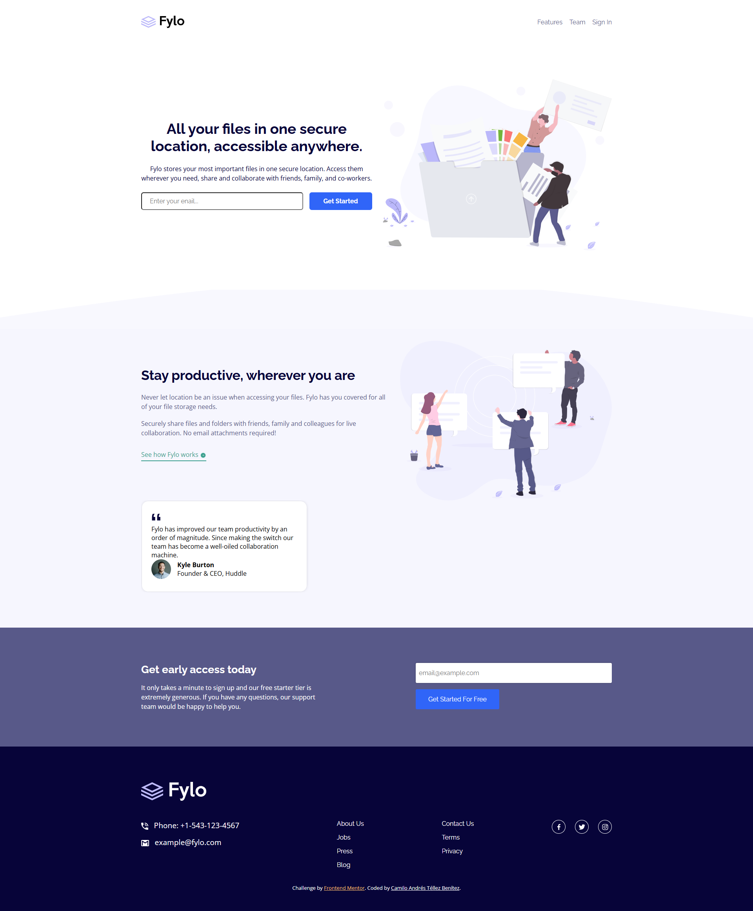

# Frontend Mentor - Solución para Fylo landing page con diseño de dos columnas

Esta es mi solución para el reto [Fylo landing page with two column layout en Frontend Mentor](https://www.frontendmentor.io/challenges/fylo-landing-page-with-two-column-layout-5ca5ef041e82137ec91a50f5). 

## Índice

- [Descripción general](#descripción-general)
  - [El reto](#el-reto)
  - [Captura de pantalla](#captura-de-pantalla)
  - [Enlace](#enlace)
- [Mi proceso](#mi-proceso)
  - [Tecnologías utilizadas](#tecnologías-utilizadas)
- [Autor](#autor)
- [Agradecimientos](#agradecimientos)

## Descripción general

### El reto

Los usuarios deben poder:

- Ver el diseño óptimo del sitio dependiendo del tamaño de pantalla de su dispositivo.

### Captura de pantalla

A continuación, muestro el resultado del proyecto en una pantalla de escritorio:

### Enlace

- URL del proyecto publicado: [Aquí estará el enlace del sitio en GitHub Pages](https://your-live-site-url.com)

## Mi proceso

### Tecnologías utilizadas

En este proyecto utilicé las siguientes herramientas y tecnologías:

- **HTML5 semántico** para una estructura clara y accesible.
- **Propiedades personalizadas de CSS** para mantener consistencia en los estilos.
- **Flexbox** para manejar los diseños flexibles y adaptables.
- Un enfoque **mobile-first** para garantizar una buena experiencia en dispositivos móviles.

## Autor

- LinkedIn - [Camilo Andrés Téllez Benítez](http://www.linkedin.com/in/camilo-téllez)
- Frontend Mentor - [@camilo-atb](https://www.frontendmentor.io/profile/camilo-atb)
- YouTube - [Camilo Téllez](https://www.youtube.com/@camilotellez887)

## Agradecimientos

Desarrollé este proyecto con el apoyo del Bootcamp Premium de Desarrollo Web Frontend de **Código Facilito**. Aunque ya tenía conocimientos en Flexbox, las clases del Bootcamp me ayudaron a complementar mis conocimientos, reforzar conceptos clave y aprender nuevos temas que me permitieron llevar este proyecto a cabo con éxito.
